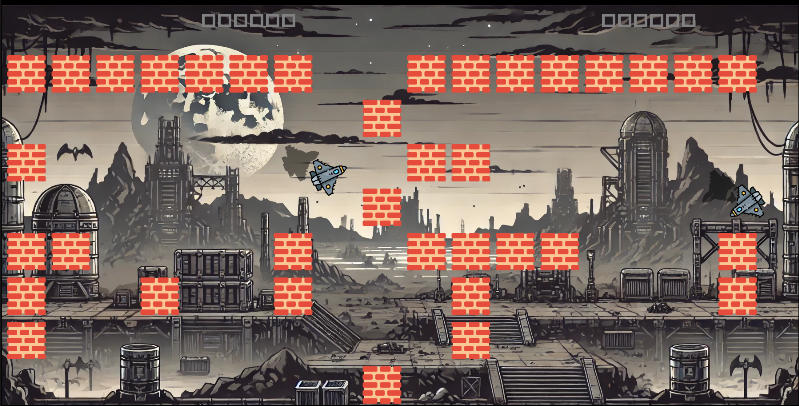

# DyneGame

DyneGame is a multiplayer 2D aerial combat game built with Go and the Ebiten game engine. Players control aircraft in a dynamic arena, engaging in tactical dogfights while navigating through obstacles.



## Features

- Real-time multiplayer gameplay
- Smooth aircraft controls with rotation and movement
- Projectile combat system
- Obstacle-based map layout
- Score tracking system
- Client-server architecture for multiplayer support

## Prerequisites

To run DyneGame, you need:

- Go 1.19 or later
- Dependencies (automatically installed via go modules):
  - github.com/hajimehoshi/ebiten/v2
  - github.com/gorilla/websocket
  - golang.org/x/image


## Installation

1. Clone the repository:
```bash
git clone https://github.com/yourusername/DyneGame.git
cd DyneGame
```

2. Install dependencies:
```bash
go mod tidy
```

## Running the Game

### Starting the Host (Server)

1. Navigate to the project directory
2. Run the host:
```bash
go run cmd/host/host.go
```

The host will start listening on:
- Port 27199 for player actions
- Port 27198 for game state synchronization

### Starting a Client

1. Open a new terminal
2. Run the client:
```bash
go run cmd/client/client.go
```

Multiple clients can connect to the same host.

## Controls

### Host Player
- W/A/S/D: Move the aircraft
- Left/Right Arrow: Rotate the aircraft
- Spacebar: Shoot

### Client Player
- W/A/S/D: Move the aircraft
- Left/Right Arrow: Rotate the aircraft
- Spacebar: Shoot

## Game Mechanics

- Each player controls an aircraft that can move in any direction
- Players can shoot projectiles at opponents
- Obstacles in the map provide tactical cover and challenge
- Hitting an opponent with projectiles increases your score
- Colliding with obstacles or screen boundaries blocks movement

## Network Architecture

The game uses a client-server architecture with WebSocket connections:
- Action Server (Port 27199): Handles player inputs and actions
- State Server (Port 27198): Synchronizes game state, positions, and projectiles

## Development

### Project Structure

```
DyneGame/
├── assets/         # Game assets (images, fonts)
├── cmd/           
│   ├── client/    # Client implementation
│   └── host/      # Host/server implementation
├── game/          # Core game logic
├── utils/         # Utility functions and helpers
└── web/           # Web-related resources
```

### Building from Source

To build the executables:

```bash
# Build host
go build -o host cmd/host/host.go

# Build client
go build -o client cmd/client/client.go
```

## Contributing

1. Fork the repository
2. Create your feature branch (`git checkout -b feature/amazing-feature`)
3. Commit your changes (`git commit -m 'Add some amazing feature'`)
4. Push to the branch (`git push origin feature/amazing-feature`)
5. Open a Pull Request

## License

This project is licensed under the MIT License - see the [LICENSE](LICENSE) file for details.

## Acknowledgments

- [Ebiten](https://ebiten.org/) - The game engine used
- [Gorilla WebSocket](https://github.com/gorilla/websocket) - WebSocket implementation 